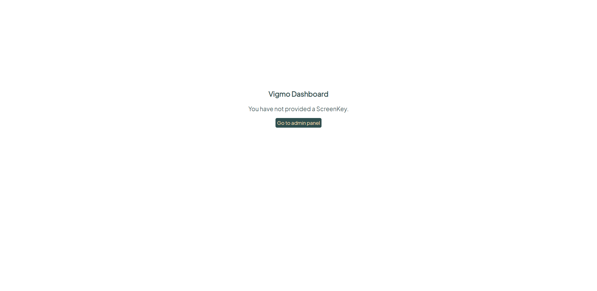
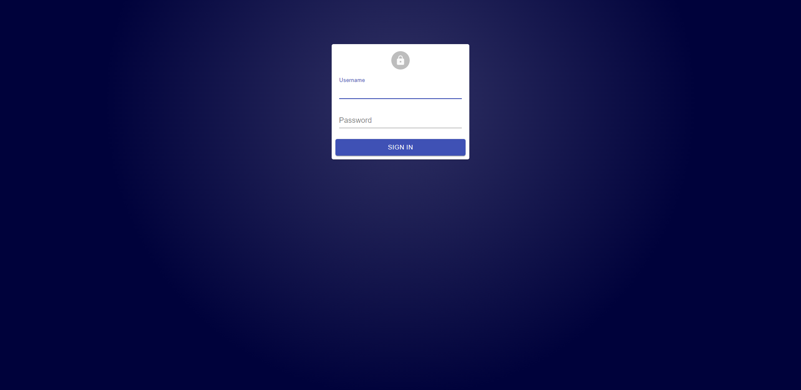

[](https://github.com/NHL-S-Vigmo/Admin-Panel/releases)
[](https://vigmo.ga/)

# NHL-S-Vigmo Admin Panel
_This project works with the [NHL-S-Vigmo Api](https://github.com/NHL-S-Vigmo/Api), which is a project for the Advanced Java Minor and is made by Students. The Admin Panel will allow the teachers to manage the digital dashboard in the aula_


# Installation
> The installation guide is written with in mind that you have a windows computer with a windows operating system. This installation guide will describe how to run the user interface as a standalone project. This is not recommended and we highly advice to build the project. There is a full installation guide over at the [Docs Repositories wiki](https://github.com/NHL-S-Vigmo/docs/wiki/).

To install the Admin Panel standalone and correctly, you should first follow the installation steps of the [Api Repository](https://github.com/NHL-S-Vigmo/Api#how-to-install). Once you have installed the [Api Repository](https://github.com/NHL-S-Vigmo/Api#how-to-install), run the webserver and mysql server. After following the [Api Repository](https://github.com/NHL-S-Vigmo/Api#how-to-install) steps you have to make sure you have installed the latest LTS version of `nodejs`. You can do this by downloading and installing this via [this installation link](https://nodejs.org/en/download/). Once you have everything installed, you can begin to install the Admin Panel.  

Start by cloning the project and saving it to a folder of your choice. Once everything is downloaded, open a terminal at the root path of the Admin Panel project. You can quickly do this by typing `cmd` in the navigation bar and pressing `enter`.


With the open cmd tab (where the path should end with the name of your favourite root folder where you installed the project) type the following command: `npm install` and pressing `enter`. This may take a minute or two. Do not close the window, you will need it after the configuration part.

## Configuration
To setup the project, we need to set some configuration values in order to work correctly. These values have to be stored in an `.env` file.
- Create your own `.env` file in the root folder
- Set the values from the example below according to your environment.
  ```
  REACT_APP_DATA_URL=http://localhost:6965
  REACT_APP_AUTH_URL=${REACT_APP_DATA_URL}/authenticate
  REACT_APP_SCREEN_AUTH_URL=${REACT_APP_DATA_URL}/authenticate_screen
  ```
- Save the file

The `REACT_APP_DATA_URL` is the url where the api is served. The `REACT_APP_AUTH_URL` is the route where the application wants to authenticate the user. For most instances you only have to change the `REACT_APP_DATA_URL`.

## Run the project
In the console window that we left open before the configuration part, we can start the project. Start the Admin Panel by typing the following command: `npm start` and pressing `enter`. This can also take a minute or two. When this is finished, your browser should show the welcome screen like the screenshot below.



When you click on the `Go to admin panel` button, you will be redirected to the login screen [http://localhost:3000/#!/login](http://localhost:3000/#!/login)



The default username and password are what configured when setting up the API. (If you followed the installation guide they are, `admin` and `changeme`.) After logging in, its adviced that you first of all change the username and password. You can now use the project to show information on a screen. To view the information, the slides should be linked to a slideshow which should be linked to a screen. The screen provides you with an unique auth key. For instance `AdyXwfnFSBY2oN4TjubQmCE6PRnFt535`. The key can be added to the base url with a `/#!/` in the middle like so: http://localhost:3000/#!/AdyXwfnFSBY2oN4TjubQmCE6PRnFt535. It's now possible to view the slideshow.
